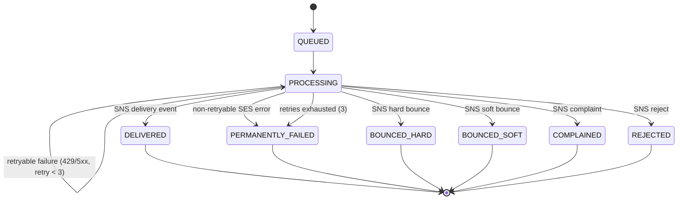
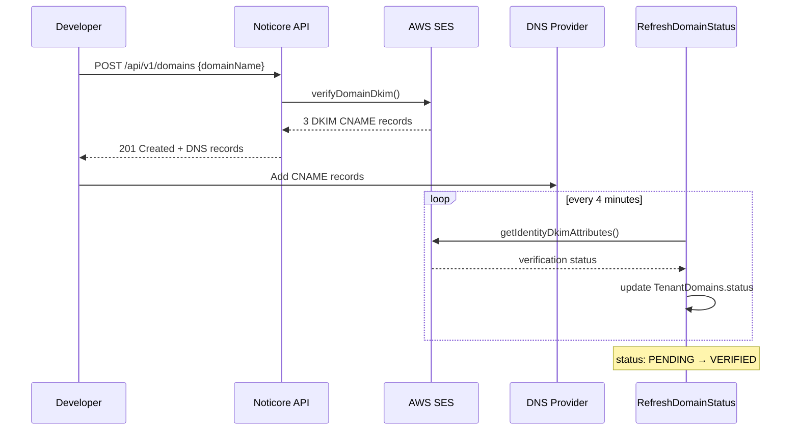
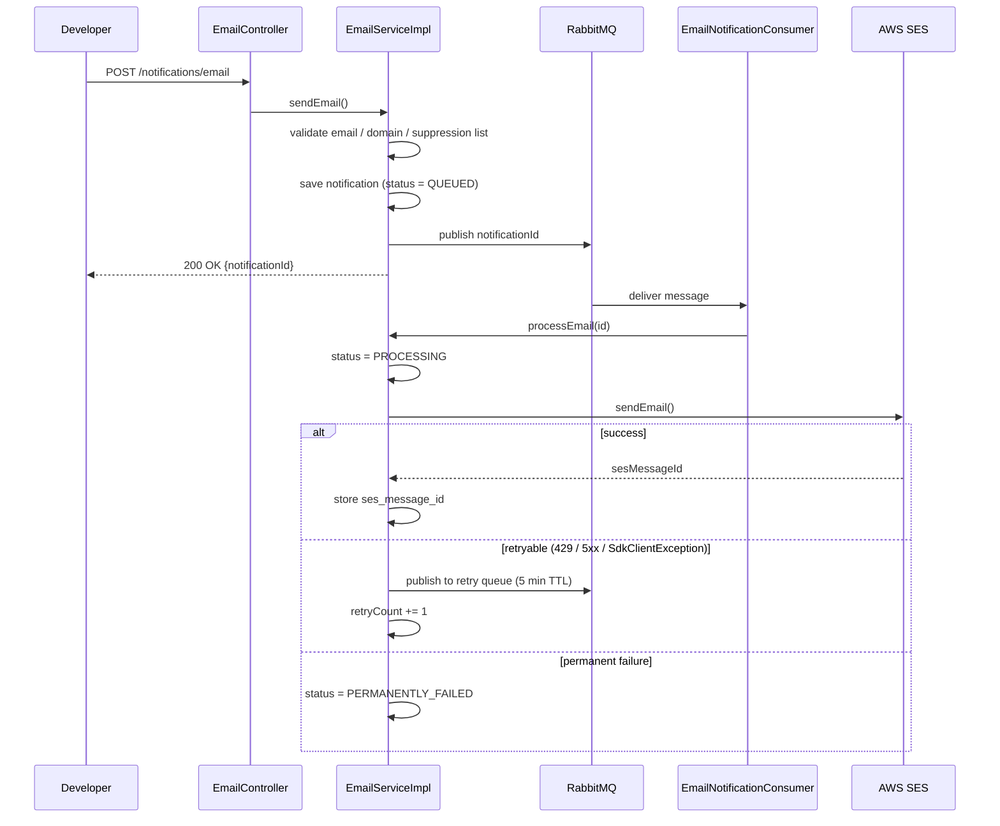
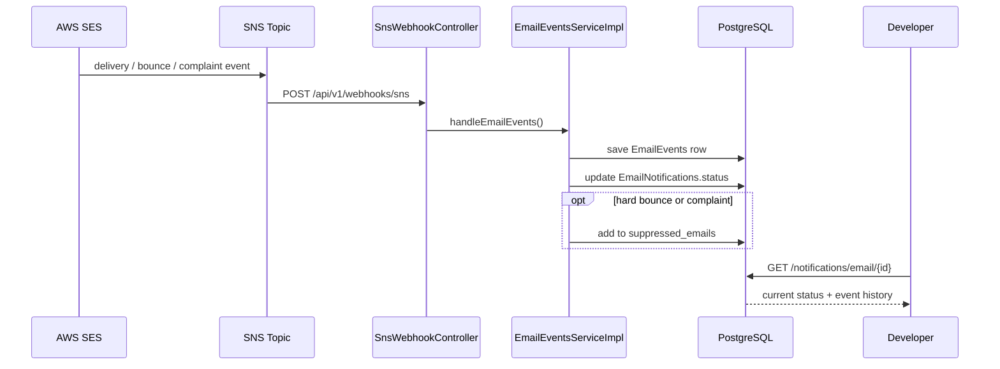
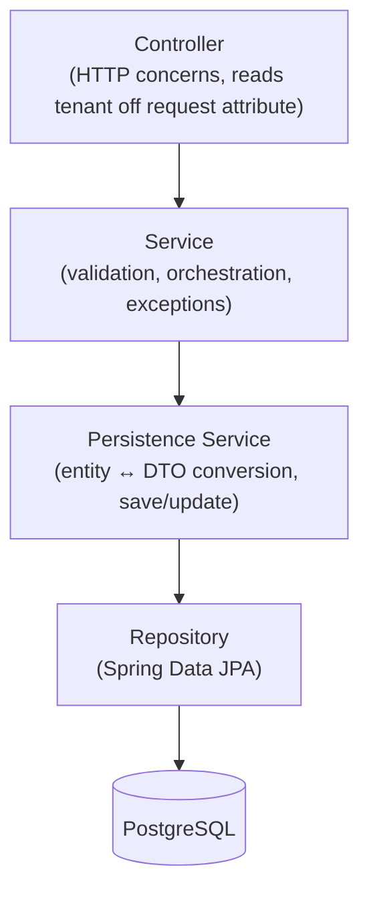
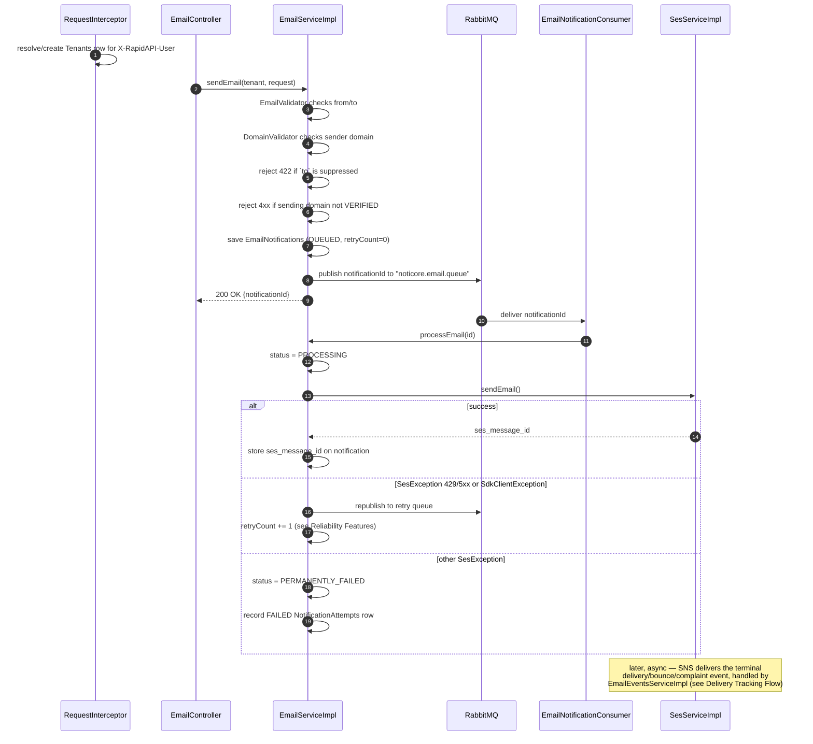
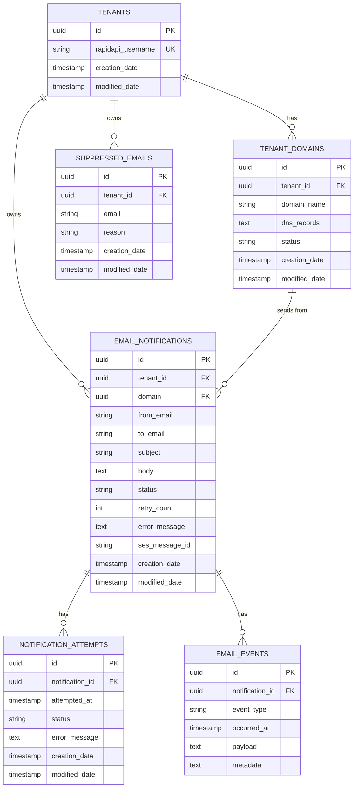
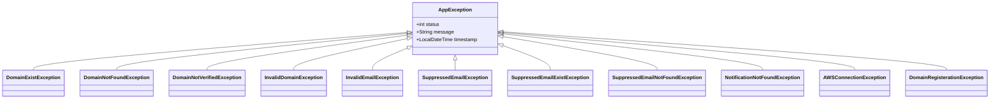

# Noticore — Professional Email Notification API

> A production-grade, multi-tenant transactional email API platform built for developers and startups who need reliable email delivery with deep deliverability insights.

---

## Overview

Noticore is a backend API platform that abstracts the complexity of transactional email infrastructure. Instead of integrating directly with AWS SES and managing domain verification, DKIM records, bounce handling, and delivery tracking themselves, developers call a single clean API.

The platform is built on top of **AWS Simple Email Service (SES)** and is designed to be deployed as a public API on RapidAPI, enabling any developer to integrate professional email sending into their application within minutes.

---

## Motivation

This project exists as a production-grade portfolio API — an opportunity to design and build a real distributed system end-to-end rather than a CRUD demo: multi-tenancy, async processing with guaranteed retry semantics, external provider integration (AWS SES), and webhook-driven state tracking (SNS), all wired together the way a small SaaS backend actually would be.

---

## Problem We Solve

Most transactional email solutions either:
- Require complex setup and domain configuration
- Provide no visibility into **why** an email failed to deliver
- Are too expensive for indie developers and early-stage startups

Noticore provides a simple REST API with **detailed deliverability intelligence** — not just "sent" or "failed", but exactly what happened at every stage of delivery.

---

## Core Features

### ✅ Multi-Tenant Architecture
- Every API subscriber gets an isolated tenant environment
- Tenant identification via `X-RapidAPI-User` header — stable across API key rotations
- Complete data isolation — tenants can never access each other's data

### ✅ Domain Management
- Register and verify custom sending domains via AWS SES DKIM
- Returns complete DNS records (type, name, value) ready to add to any DNS provider
- Automatic domain verification via background scheduler
- Support for multiple domains per tenant

### ✅ Asynchronous Email Sending
- Non-blocking API — returns immediately with a notification ID
- Background processing via RabbitMQ message queue
- Retry mechanism — up to 3 attempts with 5-minute intervals using Dead Letter Exchange (DLX)
- Prevents duplicate delivery via RabbitMQ manual acknowledgment

### ✅ Notification Status Tracking
Full status lifecycle tracking per notification:



`OPENED` and `CLICKED` are also valid `EmailNotificationStatus` values, but per `EmailEventsServiceImpl` they're recorded as `EmailEvents` history only and deliberately don't overwrite the notification's own status field.

### ✅ Deliverability Intelligence
- SNS webhook integration for real-time delivery events (SES → Noticore)
- Hard bounce detection — invalid email addresses
- Soft bounce detection — temporary delivery failures
- Spam/complaint detection
- Per-notification event history with actionable error classification
- **Note:** this is inbound only — Noticore consumes SES/SNS events and updates notification status in its own database. There is no outbound webhook to the developer's own systems yet; delivery status is polled via `GET /notifications/email/{id}`.

### 📋 Template Management (Planned)
- Create and manage reusable email templates with dynamic variables
- AWS SES template integration
- Send emails by referencing template name with variable substitution

### ✅ Suppression List Management
- Automatic suppression on hard bounce or spam complaint
- Every send checks the suppression list first and rejects suppressed recipients
- Manual add/remove via `POST` / `DELETE /api/v1/suppressions`
- Proactive bounce rate reduction

### 📋 Reputation Dashboard (Planned)
- Bounce rate, complaint rate, delivery rate per tenant
- Domain health scoring
- Sending statistics over time

---

## API Endpoints

### Domain Management
```
POST   /api/v1/domains              Register a new sending domain
GET    /api/v1/domains              List all domains for tenant
GET    /api/v1/domains/{id}         Get domain details and verification status
```

### Email Notifications
```
POST   /api/v1/notifications/email              Send an email
GET    /api/v1/notifications/email              List all notifications
GET    /api/v1/notifications/email/{id}         Get notification status
```

### Suppression List
```
POST   /api/v1/suppressions         Manually add an email to the suppression list
DELETE /api/v1/suppressions/{email} Remove an email from the suppression list
```

### Webhooks
```
POST   /api/v1/webhooks/sns         Receives AWS SES delivery events via SNS
```

---

## How It Works

### 1. Domain Registration Flow



### 2. Email Sending Flow



### 3. Delivery Tracking Flow



---

## System Architecture

**Layers** (traced through the actual package structure):



Email sending fans out into an async leg:

```mermaid
flowchart LR
    Client -->|"POST /notifications/email"| EC[EmailController]
    EC --> ES[EmailServiceImpl]
    ES -->|"validate, save QUEUED"| DB1[(PostgreSQL)]
    ES -->|"publish notificationId"| MQ{{"noticore.email.queue"}}
    ES -->|"200 OK"| Client

    MQ --> Cons[EmailNotificationConsumer]
    Cons --> PE["EmailServiceImpl.processEmail()"]
    PE --> SES_Svc[SesServiceImpl]
    SES_Svc --> SES[(AWS SES)]

    SES -->|"delivery / bounce / complaint"| SNS{{"SNS Topic"}}
    SNS --> Web[SnsWebhookController]
    Web --> WebSvc[SnsWebhookServiceImpl]
    WebSvc --> Evt[EmailEventsServiceImpl]
    Evt -->|"persist EmailEvents, update status,<br/>auto-suppress on hard bounce/complaint"| DB2[(PostgreSQL)]
```



Every controller (except `/api/v1/webhooks/**`, which SNS calls directly) goes through `RequestInterceptor`, which resolves/creates the `Tenants` row for the `X-RapidAPI-User` header and attaches it to the request before the controller method runs.

### Request Lifecycle: `POST /api/v1/notifications/email`

A concrete trace through `EmailController` → `EmailServiceImpl` → `EmailNotificationConsumer`:



---

## Database Design

Six tables, all UUID-keyed. Relationships and columns (`entity/*.java`, enforced via Liquibase foreign keys):



- **tenants** — one row per RapidAPI subscriber (`rapidapi_username`, unique). Lazily created by `RequestInterceptor` on first request.
- **tenant_domains** — sending domains registered per tenant. `dns_records` stores the SES DKIM CNAME records (JSON, via `DnsRecordsConverter`); `status` is `PENDING → VERIFIED | FAILED`, checked by `RefreshDomainStatus` every 4 minutes.
- **email_notifications** — one row per send request. `status` is checked against the `EmailNotificationStatus` enum values at the DB level; `retry_count` and `error_message` track the retry lifecycle; `ses_message_id` links a sent message to its later SNS events (indexed).
- **notification_attempts** — an append-only log of each send attempt (`SUCCESS`/`FAILED`) with its error message, distinct from the notification's current status.
- **email_events** — an append-only log of every SNS delivery event (Delivery/Bounce/Complaint/Reject/Open/Click) for a notification, with the raw payload and extracted `metadata` (bounce type, SMTP response, IP/user agent, etc.), indexed by `notification_id`.
- **suppressed_emails** — per-tenant do-not-send list. Unique on `(tenant_id, email)`, indexed on both `email` and `tenant_id`. Populated automatically on `BOUNCED_HARD`/`COMPLAINED` events, or manually via `POST/DELETE /api/v1/suppressions`.

The base schema predates the tracked Liquibase history (see the original design export at `src/main/resources/templates/drawSQL-pgsql-export-2026-04-15.sql`); every schema change since 2026-04-16 is captured incrementally in `src/main/resources/db/changelog/`.

---

## Technology Stack

| Layer | Technology |
|---|---|
| Framework | Spring Boot 3.2.5 |
| Language | Java 17 |
| Database | PostgreSQL with Liquibase migrations |
| Message Queue | RabbitMQ with Dead Letter Exchange |
| Email Delivery | AWS Simple Email Service (SES) |
| Connection Pool | HikariCP |
| ORM | Hibernate / Spring Data JPA |
| Deployment | AWS EC2 |
| API Distribution | RapidAPI |

---

## Architecture Decisions

### Why RabbitMQ
Email sending via SES takes 1-2 seconds per request. Synchronous sending would block the API for each request. RabbitMQ decouples the API from the sending process — developers get an immediate response and emails are processed asynchronously with guaranteed delivery.

### Why Dead Letter Exchange for Retries
Instead of a polling-based retry scheduler, we use RabbitMQ's native DLX + TTL mechanism. Failed messages are published to a retry queue with a 5-minute TTL. After expiry, RabbitMQ automatically routes them back to the main queue — no polling, precise timing, zero extra infrastructure.

### Why Multi-Tenancy via X-RapidAPI-User
RapidAPI's `X-RapidAPI-User` header contains the subscriber's permanent username — stable across API key rotations. This eliminates the key rotation problem that affects stateful multi-tenant APIs built on RapidAPI. Tenant creation is lazy — first request automatically provisions the tenant.

### Why Domain-Level Verification
Industry standard approach — verifies domain ownership via DKIM DNS records, establishes sending reputation at the domain level, allows sending from any address on the verified domain, and scales to unlimited tenants without per-address verification overhead.

---

## Reliability Features

- **Retry with backoff** — up to 3 attempts per notification (`EmailNotifications.retryCount`), with a fixed 5-minute delay between attempts. The delay is a static RabbitMQ message TTL (`RabbitMQConfig.RETRY_TTL`), not exponential backoff.
- **Dead Letter Exchange retry loop** — a failed send is published to `noticore.email.retry.queue`. That queue has no consumer; it exists purely to hold the message for its TTL, after which RabbitMQ dead-letters it back into the main exchange for reprocessing. No polling scheduler is involved.
- **Failure classification** (`EmailServiceImpl.processEmail`) — `SesException` with status `429` or `>=500` is treated as transient and retried; any other `SesException` status is treated as permanent and the notification is marked `PERMANENTLY_FAILED` immediately. `SdkClientException` (network/client-side failures) is always retried.
- **Attempt history** — every send attempt is recorded as a `NotificationAttempts` row, independent of the notification's current status, so a notification's full retry history is queryable.
- **Delivery event history** — every SNS event (delivery, bounce, complaint, reject, open, click) is persisted as an `EmailEvents` row with extracted metadata, giving per-notification deliverability detail beyond a single status field.
- **Automatic suppression** — a hard bounce or spam complaint adds the recipient to `suppressed_emails` for that tenant (`SuppressedEmailsServiceImpl.addSuppression`); `EmailServiceImpl.sendEmail` checks this list and rejects sends to suppressed addresses with a 422 before they ever reach the queue.

**Not implemented today:** there's no idempotency key on `POST /notifications/email` — a retried client request creates a second `EmailNotifications` row and sends a duplicate email. See [Known Limitations](#known-limitations).

---

## Error Handling Strategy

All domain errors extend `AppException` (`status`, `message`, `timestamp`), caught centrally by `GlobalExceptionHandler` and serialized as a consistent `ErrorResponse`; anything uncaught falls through to a generic 500 handler.



| Package | Exception | Status |
|---|---|---|
| `domain/` | `DomainExistException` | 409 |
| `domain/` | `DomainNotFoundException` | 404 |
| `domain/` | `DomainNotVerifiedException` | — |
| `domain/` | `InvalidDomainException` | 400 |
| `email/` | `InvalidEmailException` | 400 |
| `email/` | `SuppressedEmailException` | 422 |
| `email/` | `SuppressedEmailExistException` | 409 |
| `email/` | `SuppressedEmailNotFoundException` | 404 |
| `notification/` | `NotificationNotFoundException` | 404 |
| `ses/` | `AWSConnectionException`, `DomainRegisterationException` | — |

Inside the email-send worker path specifically, SES/AWS SDK exceptions are caught and reclassified into the retry-vs-permanent-failure decision described above, rather than bubbling up as generic errors.

---

## Transaction Strategy

Every persistence-service method is `@Transactional`; read paths (`EmailServiceImpl.getAll`, `getEmailNotification`) use `@Transactional(readOnly = true)`. Transactions are scoped per service method — a single business operation (e.g. "save a domain", "update a notification's status") is one transaction, not the whole request. `spring.jpa.open-in-view=false` is set explicitly, so lazy associations (`Tenants.tenantDomains`, `EmailNotifications.notificationAttempts`/`emailEvents`) must be accessed inside a transactional service method, not from the controller or during view serialization.

---

## Concurrency Considerations

- `RefreshDomainStatus.refreshDomainStatus()` runs on a fixed 4-minute schedule (`@Scheduled` + `@Async`) and guards against overlapping runs with an in-process `ReentrantLock.tryLock()` — if a previous run is still active, the new tick is skipped rather than queued.
- `suppressed_emails` has a DB-level unique constraint on `(tenant_id, email)`, so concurrent suppression writes for the same address can't create duplicate rows.
- **Caveat:** the `ReentrantLock` is JVM-local. Running more than one instance of this API would let each instance's scheduler fire independently — there's no distributed lock. See [Known Limitations](#known-limitations).

---

## Security

- **Tenant identification**, not authentication — `RequestInterceptor` trusts the `X-RapidAPI-User` header as-is to resolve or lazily create a tenant. There's no signature/HMAC verification of that header within this codebase; it relies entirely on RapidAPI's gateway being the only path to the API.
- **Domain ownership gating** — an email can only be sent from a domain whose SES DKIM verification status is `VERIFIED` (`DomainNotVerifiedException` otherwise).
- **Secrets** — AWS credentials are injected via environment variables (`AWS_ACCESS_KEY_ID`, `AWS_SECRET_ACCESS_KEY`) rather than hardcoded. The RabbitMQ password in `application.properties` is currently hardcoded in source — see [Known Limitations](#known-limitations).
- No rate limiting is implemented in this codebase (RapidAPI's platform may apply its own).

---

## Logging

Every service/controller uses `@Slf4j` and logs at `info` level on entry/exit of business operations (e.g. `EmailServiceImpl`, `TenantsServiceImpl`, `RefreshDomainStatus`, `EmailNotificationProducer`) and at `error` level with the exception on failure paths. There's no correlation/request ID, no structured (JSON) log output, and no custom `logback` configuration — logging uses Spring Boot's default console pattern.

---

## Design Patterns in Use

- **Repository pattern** — every entity has a Spring Data JPA repository (`repository/`); no raw JDBC/SQL outside Liquibase changesets.
- **DTO + Converter (Mapper)** — entities never leave the service layer directly; each has a `*Converter` (ModelMapper-backed) producing a purpose-built DTO (`converter/`, `dto/`).
- **Layered service split** — business-logic services (`I*Service`) are separated from persistence services (`I*PersistenceService`) for domains with multi-step orchestration (email, tenant domains), keeping validation/orchestration out of the entity-save layer.
- **Producer/Consumer** — `EmailNotificationProducer`/`EmailNotificationConsumer` decouple the API from the SES call via RabbitMQ.
- **Interceptor** — `RequestInterceptor` (a `HandlerInterceptor`) centralizes tenant resolution ahead of every controller, instead of each controller re-deriving it.
- **Dependency Injection via constructor injection** — every component uses Lombok `@RequiredArgsConstructor` on `final` fields; no field injection.

---

## Folder Structure

```
controller/     REST endpoints — HTTP concerns only, delegates to a service
service/        Business logic + validation; I*Service / *ServiceImpl pairs;
                service/external/ wraps AWS SES and the SNS webhook handler
rabbitMQ/       Producer/consumer for the async email-send queue
task/           Scheduled jobs (domain verification polling)
RequestInterceptor/  Tenant-resolution interceptor
entity/         JPA entities
repository/     Spring Data JPA repositories
dto/            Request/response and internal transfer objects
converter/      Entity <-> DTO mapping (ModelMapper) and JPA AttributeConverters
                (e.g. storing DnsRecordDto/metadata maps as JSON columns)
enums/          Status enums shared between entities and business logic
exception/      AppException hierarchy, grouped by domain (domain/, email/,
                notification/, ses/), plus the global exception handler
config/         Spring configuration (AWS SES client, RabbitMQ topology,
                interceptor registration, ModelMapper/validator/executor beans)
```

---

## AWS SES Usage

Noticore uses AWS SES as the underlying email delivery infrastructure for the following purposes:

- **Domain Identity Verification** — `verifyDomainDkim()` to register tenant domains and generate DKIM tokens
- **Email Sending** — `sendEmail()` for transactional email delivery
- **Identity Status Checking** — `getIdentityDkimAttributes()` for domain verification status polling
- **Delivery Notifications** — SNS integration for bounce, complaint, and delivery events

**Sending Volume:** Initial deployment targets developer and startup use cases with expected volume of 1,000-10,000 emails/month. All emails are transactional — triggered by developer API calls, not bulk marketing campaigns.

**Compliance:** All sending domains are verified by their owners via DNS records. Noticore enforces domain ownership verification before allowing any email to be sent from a domain.

---

## Local Setup

Prerequisites: Java 17, a local PostgreSQL instance, a local RabbitMQ instance (no Docker Compose setup exists in this repo yet).

1. Create the `noticore` database in PostgreSQL matching `spring.datasource.*` in `application.properties` (or edit that file to point elsewhere).
2. Set the AWS credentials as environment variables — `AWS_ACCESS_KEY_ID` and `AWS_SECRET_ACCESS_KEY` (referenced via `${...}` in `application.properties`; required at startup since `AwsConfig` builds an `SesClient` eagerly).
3. Ensure RabbitMQ is reachable at `localhost:5672` (or update `spring.rabbitmq.*`).
4. Run the app — Liquibase applies all pending changesets automatically on startup (`spring.liquibase.enabled=true`):
   ```
   ./mvnw spring-boot:run
   ```
5. The API listens on port `8080`. Every endpoint except `/api/v1/webhooks/**` requires an `X-RapidAPI-User` header (any non-empty string works locally — it's how a tenant gets created).

---

## Known Limitations

- **No idempotency key** on `POST /notifications/email` — a retried client request sends a duplicate email.
- **No signature verification** on the `X-RapidAPI-User` header — tenant identity is trusted as-is; this only holds up in a deployment where RapidAPI's gateway is the sole entry point.
- **Hardcoded RabbitMQ credential** in `application.properties` (unlike the AWS credentials, which are environment-variable-based).
- **Single-instance-only scheduler safety** — `RefreshDomainStatus`'s overlap guard is an in-process `ReentrantLock`; running multiple API instances would let each poll SES independently.
- **No automated test coverage** — `src/test` currently contains only the generated Spring context-load smoke test.
- **No pagination** on list endpoints (`GET /notifications/email`, `GET /domains`) — they return the tenant's full result set.
- **No index on `email_notifications.tenant_id`** — `findAllByTenants_Id`/`findByIdAndTenants_Id` (used on every "list my notifications" and "get one notification" call) currently do an unindexed scan filtered by tenant.
- **No rate limiting** implemented at the application level.

---

## Project Status

| Feature | Status |
|---|---|
| Multi-tenant interceptor | ✅ Complete |
| Domain registration | ✅ Complete |
| Domain verification scheduler | ✅ Complete |
| RabbitMQ integration | ✅ Complete |
| Email sending (async) | ✅ Complete |
| SNS webhook (inbound, updates internal status only) | ✅ Complete |
| Retry via DLX | ✅ Complete |
| Template management | 📋 Planned |
| Suppression list (auto + manual add/remove) | ✅ Complete |
| Reputation dashboard | 📋 Planned |

---

## Contact

**Developer:** Kiran Vora  
**Purpose:** This project is being built as a production-grade portfolio API to demonstrate backend engineering capabilities including distributed systems, async processing, multi-tenancy, and cloud infrastructure.

---

*Built with Spring Boot · Powered by AWS SES · Distributed via RapidAPI*
