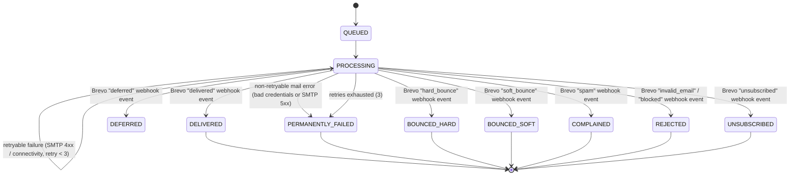
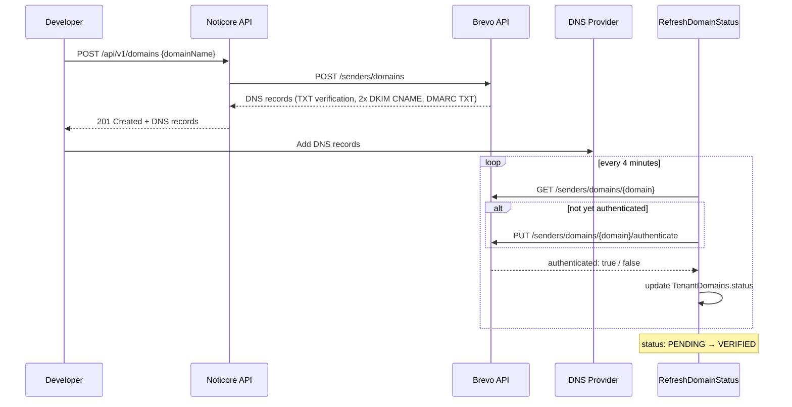
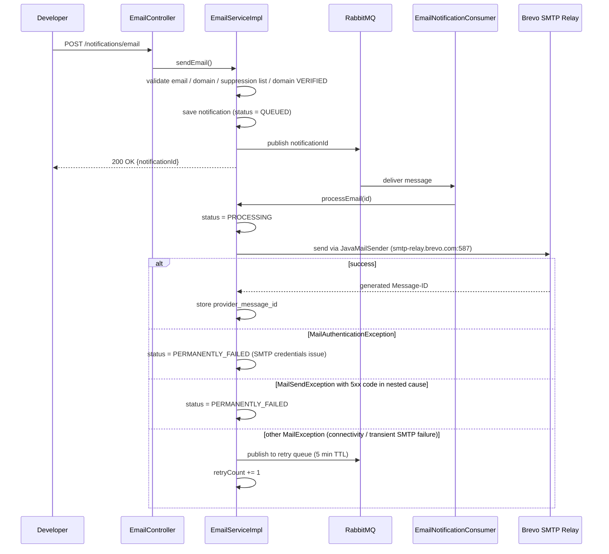
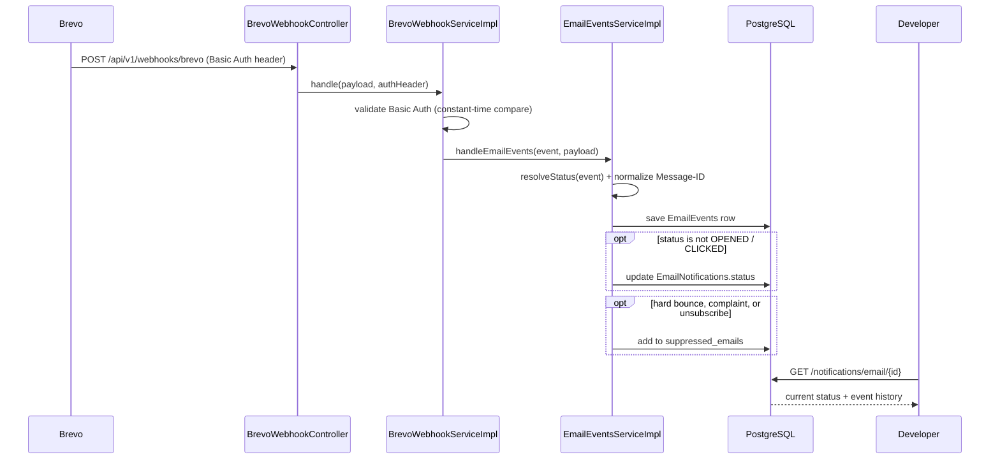
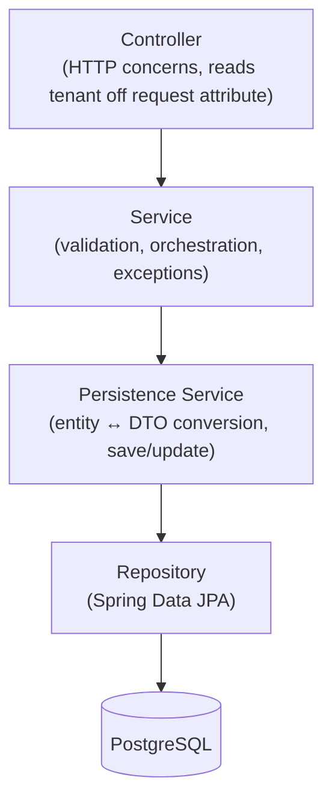
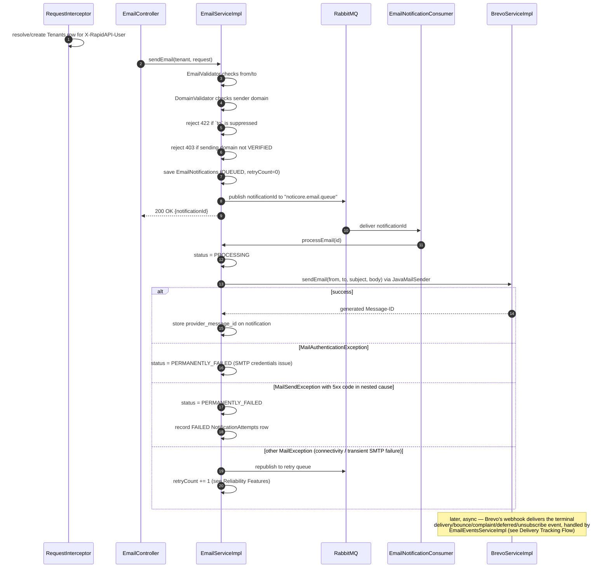
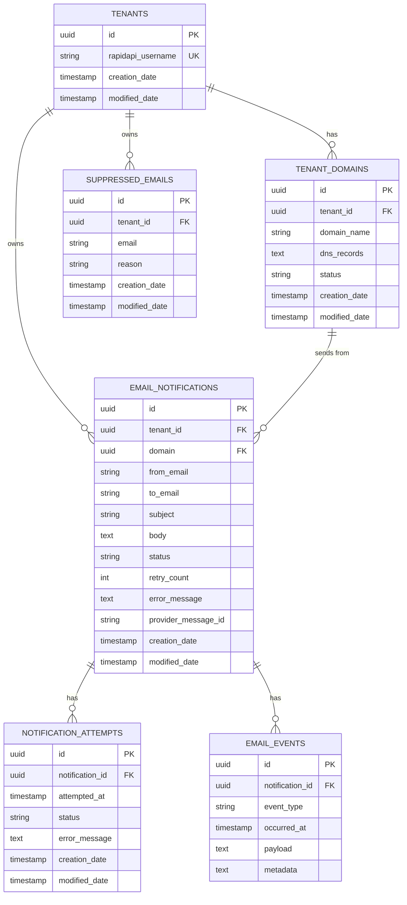
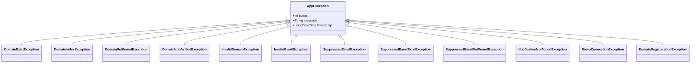

# Noticore — Professional Email Notification API

> A production-grade, multi-tenant transactional email API platform built for developers and startups who need reliable email delivery with deep deliverability insights.

---

## Overview

Noticore is a backend API platform that abstracts the complexity of transactional email infrastructure. Instead of integrating directly with an email provider and managing domain verification, DKIM records, bounce handling, and delivery tracking themselves, developers call a single clean API.

The platform is built on top of **Brevo's transactional email platform** — its Senders API for domain verification/authentication, its SMTP relay for sending, and its native delivery webhook for tracking — and is designed to be deployed as a public API on RapidAPI, enabling any developer to integrate professional email sending into their application within minutes.

> **Note:** Noticore originally launched on AWS SES + SNS. It has since fully migrated to Brevo; every section below describes the current, Brevo-based architecture.

---

## Motivation

This project exists as a production-grade portfolio API — an opportunity to design and build a real distributed system end-to-end rather than a CRUD demo: multi-tenancy, async processing with guaranteed retry semantics, external provider integration (Brevo's transactional email API + SMTP relay), and webhook-driven state tracking via Brevo's native delivery webhook, all wired together the way a small SaaS backend actually would be.

---

## Problem We Solve

Most transactional email solutions either:
- Require complex setup and domain configuration
- Provide no visibility into **why** an email failed to deliver
- Are too expensive for indie developers and early-stage startups

Noticore provides a simple REST API with **detailed deliverability intelligence** — not just "sent" or "failed", but exactly what happened at every stage of delivery.

---

## Core Features

### ✅ Multi-Tenant Architecture
- Every API subscriber gets an isolated tenant environment
- Tenant identification via `X-RapidAPI-User` header — stable across API key rotations
- Complete data isolation — tenants can never access each other's data

### ✅ Domain Management
- Register and verify custom sending domains via Brevo's Senders API
- Returns complete DNS records (TXT verification code, 2× DKIM CNAME, DMARC TXT) ready to add to any DNS provider
- Automatic domain verification via background scheduler, which explicitly triggers Brevo's authenticate endpoint once DNS is confirmed in place — Brevo does **not** authenticate a domain automatically just because DNS matches
- Domain names are globally unique across the whole account — registering a domain already claimed by another tenant is rejected (409), without revealing that it belongs to someone else
- Support for multiple domains per tenant
- Domains can be deleted (`DELETE /api/v1/domains/{id}`); a domain that has ever been used to send an email is protected from deletion (409) to avoid orphaning send history

### ✅ Asynchronous Email Sending
- Non-blocking API — returns immediately with a notification ID
- Background processing via RabbitMQ message queue
- Retry mechanism — up to 3 attempts with 5-minute intervals using Dead Letter Exchange (DLX)
- Prevents duplicate delivery via RabbitMQ manual acknowledgment

### ✅ Notification Status Tracking
Full status lifecycle tracking per notification:



`OPENED` and `CLICKED` are also valid `EmailNotificationStatus` values, but per `EmailEventsServiceImpl` they're recorded as `EmailEvents` history only and deliberately don't overwrite the notification's own status field. `DEFERRED` is likewise event history + a status update, but is never retried by Noticore itself — it just reflects that Brevo is still trying on its end.

### ✅ Deliverability Intelligence
- Native Brevo webhook integration for real-time delivery events (`POST /api/v1/webhooks/brevo`)
- Authenticated via HTTP Basic Auth (constant-time credential comparison), not payload signing
- Hard bounce, soft bounce, deferred, spam complaint, invalid/blocked address, and unsubscribe detection
- Per-notification event history with the raw payload and extracted, event-specific metadata
- **Note:** this is inbound only — Noticore consumes Brevo webhook events and updates notification status in its own database. There is no outbound webhook to the developer's own systems yet; delivery status is polled via `GET /api/v1/notifications/email/{id}`.

### 📋 Template Management (Planned)
- Create and manage reusable email templates with dynamic variables
- Send emails by referencing template name with variable substitution

### ✅ Suppression List Management
- Automatic suppression on hard bounce, spam complaint, or unsubscribe event
- Every send checks the suppression list first and rejects suppressed recipients (422)
- Manual management via `POST` / `GET` / `DELETE /api/v1/suppressions` — both `GET` (list) and `DELETE` return the full suppression record (id, email, reason, timestamps) as JSON
- Proactive bounce rate reduction

### 📋 Reputation Dashboard (Planned)
- Bounce rate, complaint rate, delivery rate per tenant
- Domain health scoring
- Sending statistics over time

---

## API Endpoints

### Domain Management
```
POST   /api/v1/domains              Register a new sending domain
GET    /api/v1/domains              List all domains for tenant
GET    /api/v1/domains/{id}         Get domain details and verification status
DELETE /api/v1/domains/{id}         Delete a domain (409 if it has ever sent an email)
```

### Email Notifications
```
POST   /api/v1/notifications/email              Send an email
GET    /api/v1/notifications/email              List all notifications
GET    /api/v1/notifications/email/{id}         Get notification status
```

### Suppression List
```
POST   /api/v1/suppressions         Manually add an email to the suppression list
GET    /api/v1/suppressions         List all suppressed emails for the tenant
DELETE /api/v1/suppressions/{email} Remove an email from the suppression list (returns the removed record)
```

### Webhooks
```
POST   /api/v1/webhooks/brevo       Receives Brevo transactional email delivery events (HTTP Basic Auth)
```

---

## How It Works

### 1. Domain Registration Flow



### 2. Email Sending Flow



### 3. Delivery Tracking Flow



---

## System Architecture

**Layers** (traced through the actual package structure):



Email sending fans out into an async leg:

```mermaid
flowchart LR
    Client -->|"POST /notifications/email"| EC[EmailController]
    EC --> ES[EmailServiceImpl]
    ES -->|"validate, save QUEUED"| DB1[(PostgreSQL)]
    ES -->|"publish notificationId"| MQ{{"noticore.email.queue"}}
    ES -->|"200 OK"| Client

    MQ --> Cons[EmailNotificationConsumer]
    Cons --> PE["EmailServiceImpl.processEmail()"]
    PE --> BrevoSvc[BrevoServiceImpl]
    BrevoSvc --> Brevo[(Brevo SMTP Relay)]

    Brevo -->|"delivered / bounce / spam / deferred / etc."| Hook{{"Brevo Webhook"}}
    Hook --> Web[BrevoWebhookController]
    Web --> WebSvc[BrevoWebhookServiceImpl]
    WebSvc --> Evt[EmailEventsServiceImpl]
    Evt -->|"persist EmailEvents, update status,<br/>auto-suppress on hard bounce/complaint/unsubscribe"| DB2[(PostgreSQL)]
```



Every controller (except `/api/v1/webhooks/**`, which Brevo calls directly) goes through `RequestInterceptor`, which resolves/creates the `Tenants` row for the `X-RapidAPI-User` header and attaches it to the request before the controller method runs.

### Request Lifecycle: `POST /api/v1/notifications/email`

A concrete trace through `EmailController` → `EmailServiceImpl` → `EmailNotificationConsumer`:



---

## Database Design

Six tables, all UUID-keyed. Relationships and columns (`entity/*.java`, enforced via Liquibase foreign keys):



- **tenants** — one row per RapidAPI subscriber (`rapidapi_username`, unique). Lazily created by `RequestInterceptor` on first request.
- **tenant_domains** — sending domains registered per tenant. `dns_records` stores Brevo's DNS records (JSON, via `DnsRecordsConverter`); `status` is `PENDING → VERIFIED | FAILED`, checked by `RefreshDomainStatus` every 4 minutes, which also triggers Brevo's `/authenticate` endpoint.
- **email_notifications** — one row per send request. `status` is checked against the `EmailNotificationStatus` enum values at the DB level (`QUEUED`, `PROCESSING`, `DELIVERED`, `PERMANENTLY_FAILED`, `BOUNCED_HARD`, `BOUNCED_SOFT`, `COMPLAINED`, `REJECTED`, `OPENED`, `CLICKED`, `DEFERRED`, `UNSUBSCRIBED`); `retry_count` and `error_message` track the retry lifecycle; `provider_message_id` links the SMTP-generated `Message-ID` header to the webhook events Brevo later echoes back for it (indexed, via `findByProviderMessageId`).
- **notification_attempts** — an append-only log of each send attempt (`SUCCESS`/`FAILED`) with its error message, distinct from the notification's current status. Lazily fetched with `@BatchSize(25)` to avoid an N+1 query pattern on list/detail endpoints.
- **email_events** — an append-only log of every Brevo webhook event (delivered, hard/soft bounce, spam, deferred, blocked/invalid, unsubscribed, open, click) for a notification, with the raw payload and extracted `metadata`. Also fetched with `@BatchSize(25)`.
- **suppressed_emails** — per-tenant do-not-send list. Unique on `(tenant_id, email)`, indexed on both `email` and `tenant_id`. Populated automatically on `BOUNCED_HARD`/`COMPLAINED`/`UNSUBSCRIBED` events, or manually via `POST`/`GET`/`DELETE /api/v1/suppressions`.

The base schema predates the tracked Liquibase history (see the original design export at `src/main/resources/templates/drawSQL-pgsql-export-2026-04-15.sql`); every schema change since 2026-04-16 is captured incrementally in `src/main/resources/db/changelog/`, most recently the 2026-09-13 changeset adding `DEFERRED`/`UNSUBSCRIBED` to the `email_notifications_status_check` constraint as part of the Brevo webhook expansion.

---

## Technology Stack

| Layer | Technology |
|---|---|
| Framework | Spring Boot 3.2.5 |
| Language | Java 17 |
| Database | PostgreSQL with Liquibase migrations |
| Message Queue | RabbitMQ with Dead Letter Exchange |
| Email Delivery | Brevo (Transactional Email API + SMTP relay) |
| Connection Pool | HikariCP |
| ORM | Hibernate / Spring Data JPA |
| Deployment | AWS EC2 |
| API Distribution | RapidAPI |

---

## Architecture Decisions

### Why RabbitMQ
Email sending takes 1-2 seconds per request. Synchronous sending would block the API for each request. RabbitMQ decouples the API from the sending process — developers get an immediate response and emails are processed asynchronously with guaranteed delivery.

### Why Dead Letter Exchange for Retries
Instead of a polling-based retry scheduler, we use RabbitMQ's native DLX + TTL mechanism. Failed messages are published to a retry queue with a 5-minute TTL. After expiry, RabbitMQ automatically routes them back to the main queue — no polling, precise timing, zero extra infrastructure.

### Why Multi-Tenancy via X-RapidAPI-User
RapidAPI's `X-RapidAPI-User` header contains the subscriber's permanent username — stable across API key rotations. This eliminates the key rotation problem that affects stateful multi-tenant APIs built on RapidAPI. Tenant creation is lazy — first request automatically provisions the tenant.

### Why Domain-Level Verification
Industry standard approach — verifies domain ownership via DNS records, establishes sending reputation at the domain level, allows sending from any address on the verified domain, and scales to unlimited tenants without per-address verification overhead.

### Why SMTP relay instead of Brevo's REST send endpoint
Sending goes through Spring's `JavaMailSender` against Brevo's SMTP relay rather than Brevo's transactional-email REST API. This lets Noticore explicitly set the outgoing `Message-ID` header itself and store that same value as `provider_message_id` — since SMTP relays (Brevo included) preserve an explicitly-set `Message-ID`, this is what correlates a sent email to the webhook events Brevo fires for it later.

---

## Reliability Features

- **Retry with backoff** — up to 3 attempts per notification (`EmailNotifications.retryCount`), with a fixed 5-minute delay between attempts. The delay is a static RabbitMQ message TTL (`RabbitMQConfig.RETRY_TTL`), not exponential backoff.
- **Dead Letter Exchange retry loop** — a failed send is published to `noticore.email.retry.queue`. That queue has no consumer; it exists purely to hold the message for its TTL, after which RabbitMQ dead-letters it back into the main exchange for reprocessing. No polling scheduler is involved.
- **Failure classification** (`EmailServiceImpl.processEmail`) — `MailAuthenticationException` is always treated as permanent (SMTP credentials/config issue, not retryable). `MailSendException` is inspected for a 5xx SMTP reply code in its nested cause messages (regex match on `5\d{2}`); if found it's permanent, otherwise it's retried. Any other `MailException` (connectivity issues, 4xx replies) is always retried.
- **Attempt history** — every send attempt is recorded as a `NotificationAttempts` row, independent of the notification's current status, so a notification's full retry history is queryable.
- **Delivery event history** — every Brevo webhook event (delivered, hard/soft bounce, spam complaint, deferred, blocked/invalid, unsubscribed, open, click) is persisted as an `EmailEvents` row with extracted metadata, giving per-notification deliverability detail beyond a single status field.
- **Automatic suppression** — a hard bounce, spam complaint, or unsubscribe event adds the recipient to `suppressed_emails` for that tenant (`SuppressedEmailsServiceImpl.addSuppression`); `EmailServiceImpl.sendEmail` checks this list and rejects sends to suppressed addresses with a 422 before they ever reach the queue.
- **N+1 query mitigation** — `EmailNotifications.notificationAttempts` and `.emailEvents` (both lazy `@OneToMany`) are annotated `@BatchSize(size = 25)`, batching what would otherwise be one query per notification into a single `WHERE notification_id IN (...)` call.
- **Connection pool sizing** — HikariCP `maximum-pool-size` is 30 (`minimum-idle=4`, `connection-timeout=30000`ms), raised from the Spring Boot default of 10 after load testing surfaced pool exhaustion under concurrent load (see [Performance](#performance)).

**Not implemented today:** there's no idempotency key on `POST /notifications/email` — a retried client request creates a second `EmailNotifications` row and sends a duplicate email. See [Known Limitations](#known-limitations).

---

## Performance

The API was load tested with [k6](https://k6.io) directly against the production EC2 instance, hitting only read-only, database-backed endpoints (list/get notifications, list/get domains) — no email sending or domain registration, to avoid burning real Brevo sends/registrations.

| Run | Conditions | Failure rate | Throughput | Latency | Root cause / outcome |
|---|---|---|---|---|---|
| 1 | Synthetic tenant, staged up to 500 VUs | 50.10% | — | p95 ≈ 247ms | False failures — the synthetic tenant had no data, so by-ID lookups against real IDs (owned by a different tenant) correctly 404'd |
| 2 | Real tenant, 100 VUs | 12.80% | — | Bimodal, tail up to 60s | HikariCP pool (default size 10) exhausted, compounded by an N+1 query pattern on `notificationAttempts`/`emailEvents` |
| 3 | Real tenant, 100 VUs, after fixes | 23.58% | 58.9 req/s | p90 324ms, p95 12.01s | `@BatchSize(25)` + HikariCP pool raised to 30; throughput accepted as sufficient for initial launch traffic |

Further tuning was deliberately deferred — ~59 req/s comfortably exceeds the expected initial traffic for a newly-launched API (see [Brevo Usage](#brevo-usage) sending-volume estimate).

---

## Error Handling Strategy

All domain errors extend `AppException` (`status`, `message`, `timestamp`), caught centrally by `GlobalExceptionHandler` and serialized as a consistent `ErrorResponse`; anything uncaught falls through to a generic 500 handler.



| Package | Exception | Status |
|---|---|---|
| `domain/` | `DomainExistException` | 409 |
| `domain/` | `DomainInUseException` | 409 |
| `domain/` | `DomainNotFoundException` | 404 |
| `domain/` | `DomainNotVerifiedException` | 403 |
| `domain/` | `InvalidDomainException` | 400 |
| `email/` | `InvalidEmailException` | 400 |
| `email/` | `SuppressedEmailException` | 422 |
| `email/` | `SuppressedEmailExistException` | 409 |
| `email/` | `SuppressedEmailNotFoundException` | 404 |
| `notification/` | `NotificationNotFoundException` | 404 |
| `brevo/` | `BrevoConnectionException` | 503 |
| `brevo/` | `DomainRegisterationException` | 500 |

**Caveat:** `BrevoDomainNotFoundException` (`exception/brevo/`) is the one exception that does **not** extend `AppException` — it's caught internally by `RefreshDomainStatus` to mark a domain `FAILED` rather than surfaced through `GlobalExceptionHandler`'s `AppException` branch. If it ever escaped uncaught elsewhere, it would fall through to the generic 500 handler instead of returning a typed error.

Inside the email-send worker path specifically, Brevo/SMTP mail exceptions (`MailException` and its subtypes) are caught and reclassified into the retry-vs-permanent-failure decision described above, rather than bubbling up as generic errors.

---

## Transaction Strategy

Every persistence-service method is `@Transactional`; read paths (`EmailServiceImpl.getAll`, `getEmailNotification`) use `@Transactional(readOnly = true)`. Transactions are scoped per service method — a single business operation (e.g. "save a domain", "update a notification's status") is one transaction, not the whole request. `spring.jpa.open-in-view=false` is set explicitly, so lazy associations (`Tenants.tenantDomains`, `EmailNotifications.notificationAttempts`/`emailEvents`) must be accessed inside a transactional service method, not from the controller or during view serialization.

---

## Concurrency Considerations

- `RefreshDomainStatus.refreshDomainStatus()` runs on a fixed 4-minute schedule (`@Scheduled` + `@Async`) and guards against overlapping runs with an in-process `ReentrantLock.tryLock()` — if a previous run is still active, the new tick is skipped rather than queued.
- `suppressed_emails` has a DB-level unique constraint on `(tenant_id, email)`, so concurrent suppression writes for the same address can't create duplicate rows.
- **Caveat:** the `ReentrantLock` is JVM-local. Running more than one instance of this API would let each instance's scheduler fire independently — there's no distributed lock. See [Known Limitations](#known-limitations).

---

## Security

- **Tenant identification**, not authentication — `RequestInterceptor` trusts the `X-RapidAPI-User` header as-is to resolve or lazily create a tenant. There's no signature/HMAC verification of that header within this codebase; it relies entirely on RapidAPI's gateway being the only path to the API.
- **Domain ownership gating** — an email can only be sent from a domain whose Brevo verification status is `VERIFIED` (`DomainNotVerifiedException`, 403, otherwise).
- **Webhook authentication** — `POST /api/v1/webhooks/brevo` is verified via HTTP Basic Auth: the `Authorization` header is matched case-insensitively against the `Basic ` prefix (Brevo sends it lowercase), Base64-decoded, and the username/password are each compared against `brevo.webhook.username`/`password` using constant-time `MessageDigest.isEqual` rather than `.equals()`, to avoid timing attacks. A missing or invalid header returns 401 before the payload is even parsed.
- **Secrets** — Brevo credentials (`BREVO_API_KEY`, `BREVO_SMTP_USERNAME`, `BREVO_SMTP_PASSWORD`, `BREVO_WEBHOOK_USERNAME`, `BREVO_WEBHOOK_PASSWORD`) are injected via environment variables rather than hardcoded. The RabbitMQ password in the dev `application.properties` is currently hardcoded in source (production uses a `RABBITMQ_PASSWORD` environment variable) — see [Known Limitations](#known-limitations).
- No rate limiting is implemented in this codebase (RapidAPI's platform may apply its own).

---

## Logging

Every service/controller uses `@Slf4j` and logs at `info` level on entry/exit of business operations (e.g. `EmailServiceImpl`, `TenantsServiceImpl`, `RefreshDomainStatus`, `EmailNotificationProducer`) and at `error`/`warn` level with the exception on failure paths — `GlobalExceptionHandler` itself now logs every `AppException` (warn) and generic `Exception` (error) it handles, rather than failing silently. There's no correlation/request ID, no structured (JSON) log output, and no custom `logback` configuration — logging uses Spring Boot's default console pattern.

---

## Design Patterns in Use

- **Repository pattern** — every entity has a Spring Data JPA repository (`repository/`); no raw JDBC/SQL outside Liquibase changesets.
- **DTO + Converter (Mapper)** — entities never leave the service layer directly; each has a `*Converter` (ModelMapper-backed) producing a purpose-built DTO (`converter/`, `dto/`).
- **Layered service split** — business-logic services (`I*Service`) are separated from persistence services (`I*PersistenceService`) for domains with multi-step orchestration (email, tenant domains), keeping validation/orchestration out of the entity-save layer.
- **Producer/Consumer** — `EmailNotificationProducer`/`EmailNotificationConsumer` decouple the API from the Brevo SMTP call via RabbitMQ.
- **Interceptor** — `RequestInterceptor` (a `HandlerInterceptor`) centralizes tenant resolution ahead of every controller, instead of each controller re-deriving it.
- **Dependency Injection via constructor injection** — every component uses Lombok `@RequiredArgsConstructor` on `final` fields; no field injection.

---

## Folder Structure

```
controller/     REST endpoints — HTTP concerns only, delegates to a service
service/        Business logic + validation; I*Service / *ServiceImpl pairs;
                service/external/ wraps the Brevo REST/SMTP integration and
                the Brevo webhook handler
rabbitMQ/       Producer/consumer for the async email-send queue
task/           Scheduled jobs (domain verification polling)
RequestInterceptor/  Tenant-resolution interceptor
entity/         JPA entities
repository/     Spring Data JPA repositories
dto/            Request/response and internal transfer objects
converter/      Entity <-> DTO mapping (ModelMapper) and JPA AttributeConverters
                (e.g. storing DnsRecordDto/metadata maps as JSON columns)
enums/          Status enums shared between entities and business logic
exception/      AppException hierarchy, grouped by domain (domain/, email/,
                notification/, brevo/), plus the global exception handler
config/         Spring configuration (Brevo RestTemplate/credentials, RabbitMQ
                topology, interceptor registration, ModelMapper/validator/
                executor beans)
```

---

## Brevo Usage

Noticore uses Brevo as the underlying email delivery infrastructure for the following purposes:

- **Domain Identity Verification** — `POST /v3/senders/domains` to register a tenant domain and retrieve its DNS records (TXT verification code, 2× DKIM CNAME, DMARC TXT)
- **Domain Authentication** — `PUT /v3/senders/domains/{domain}/authenticate`, triggered by `RefreshDomainStatus` once DNS is confirmed in place (Brevo does not authenticate automatically just because DNS matches)
- **Domain Deletion** — `DELETE /v3/senders/domains/{domainName}` when a tenant removes an unused domain
- **Email Sending** — via Spring's `JavaMailSender` over Brevo's SMTP relay (`smtp-relay.brevo.com:587`), not Brevo's REST send endpoint
- **Delivery Notifications** — a native Brevo webhook (`POST /api/v1/webhooks/brevo`, HTTP Basic Auth) for delivered / bounce / deferred / complaint / unsubscribe / open / click events

**Sending Volume:** Initial deployment targets developer and startup use cases with expected volume of 1,000-10,000 emails/month. All emails are transactional — triggered by developer API calls, not bulk marketing campaigns.

**Compliance:** All sending domains are verified by their owners via DNS records before Brevo authenticates them, and Noticore enforces a `VERIFIED` domain status (403 otherwise) before allowing any email to be sent from it.

---

## Local Setup

Prerequisites: Java 17, a local PostgreSQL instance, a local RabbitMQ instance, a Brevo account (no Docker Compose setup exists in this repo yet).

1. Create the `noticore` database in PostgreSQL matching `spring.datasource.*` in `application.properties` (or edit that file to point elsewhere).
2. Set the Brevo credentials as environment variables:
   - `BREVO_API_KEY` — Brevo API key, used for the domain registration/status/delete REST calls
   - `BREVO_SMTP_USERNAME` / `BREVO_SMTP_PASSWORD` — Brevo SMTP relay credentials, used by `JavaMailSender` to actually send mail
   - `BREVO_WEBHOOK_USERNAME` / `BREVO_WEBHOOK_PASSWORD` — the Basic Auth credentials configured on Brevo's webhook dashboard (see [Security](#security)); optional locally (the webhook auth check fails closed if unset), but required in production for the webhook endpoint to accept real requests
3. Ensure RabbitMQ is reachable at `localhost:5672` (or update `spring.rabbitmq.*`).
4. Run the app — Liquibase applies all pending changesets automatically on startup (`spring.liquibase.enabled=true`):
   ```
   ./mvnw spring-boot:run
   ```
5. The API listens on port `8080`. Every endpoint except `/api/v1/webhooks/**` requires an `X-RapidAPI-User` header (any non-empty string works locally — it's how a tenant gets created).

---

## Known Limitations

- **No idempotency key** on `POST /notifications/email` — a retried client request sends a duplicate email.
- **No signature verification** on the `X-RapidAPI-User` header — tenant identity is trusted as-is; this only holds up in a deployment where RapidAPI's gateway is the sole entry point.
- **Hardcoded RabbitMQ credential** in the dev `application.properties` (production uses a `RABBITMQ_PASSWORD` environment variable instead).
- **Single-instance-only scheduler safety** — `RefreshDomainStatus`'s overlap guard is an in-process `ReentrantLock`; running multiple API instances would let each poll Brevo independently.
- **`BrevoDomainNotFoundException` doesn't extend `AppException`** — unlike every other domain exception, it must be caught explicitly by its callers (currently only `RefreshDomainStatus`); if it ever escaped uncaught it would fall through to the generic 500 handler instead of a typed error response.
- **No automated test coverage** — `src/test` currently contains only the generated Spring context-load smoke test.
- **No pagination** on list endpoints (`GET /notifications/email`, `GET /domains`, `GET /suppressions`) — they return the tenant's full result set.
- **No index on `email_notifications.tenant_id`** — `findAllByTenants_Id`/`findByIdAndTenants_Id` (used on every "list my notifications" and "get one notification" call) currently do an unindexed scan filtered by tenant.
- **No outbound webhook** to developers' own systems — delivery status must be polled.
- **No rate limiting** implemented at the application level.

---

## Project Status

| Feature | Status |
|---|---|
| Multi-tenant interceptor | ✅ Complete |
| Domain registration (Brevo) | ✅ Complete |
| Domain verification scheduler | ✅ Complete |
| Domain deletion | ✅ Complete |
| Cross-tenant domain uniqueness | ✅ Complete |
| RabbitMQ integration | ✅ Complete |
| Email sending (async, via Brevo SMTP relay) | ✅ Complete |
| Brevo webhook (inbound, Basic Auth, updates internal status) | ✅ Complete |
| Retry via DLX | ✅ Complete |
| Load testing | ✅ Complete (see [Performance](#performance)) |
| Template management | 📋 Planned |
| Suppression list (auto + manual add/list/remove) | ✅ Complete |
| Reputation dashboard | 📋 Planned |

---

## Contact

**Developer:** Kiran Vora  
**Purpose:** This project is being built as a production-grade portfolio API to demonstrate backend engineering capabilities including distributed systems, async processing, multi-tenancy, and cloud infrastructure.

---

*Built with Spring Boot · Powered by Brevo · Distributed via RapidAPI*
